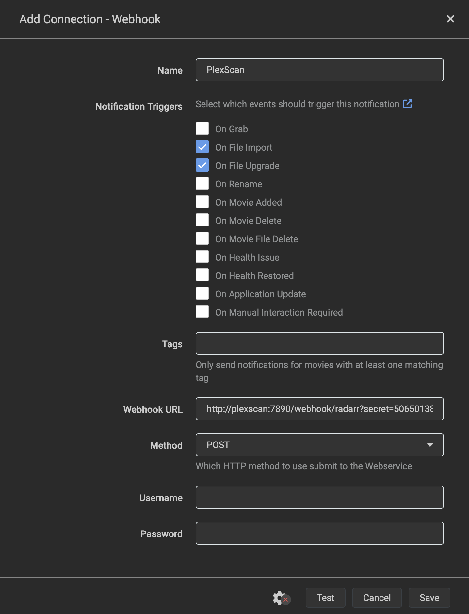

# PlexScan

Lightweight webhook relay that triggers Plex partial scans when Radarr or Sonarr import media. No polling, no filesystem watchers — pure event-driven.

## How it works

1. Radarr/Sonarr imports media and sends a webhook to PlexScan
2. PlexScan validates the secret, extracts the folder path, and debounces duplicate events (5s window)
3. PlexScan tells Plex to scan just that folder
4. New media appears in Plex within seconds

## Setup

### Step 1: Find your Plex token

Follow the official guide: [Finding an authentication token](https://support.plex.tv/articles/204059436-finding-an-authentication-token-x-plex-token/)

### Step 2: Find your Plex section IDs

Run this command, replacing `YOUR_PLEX_IP` and `YOUR_TOKEN`:

```bash
curl -s "http://YOUR_PLEX_IP:32400/library/sections?X-Plex-Token=YOUR_TOKEN" | grep -o 'key="[0-9]*" type="[^"]*" title="[^"]*"'
```

Example output:

```
key="1" type="movie" title="Movies"
key="2" type="show" title="TV Shows"
```

Note the `key` values — you'll use them as `MOVIES_SECTION_ID` and `TV_SECTION_ID`.

### Step 3: Generate a webhook secret

```bash
openssl rand -hex 32
```

Save this value — you'll use it in both the Docker Compose and the Radarr/Sonarr webhook URLs.

### Step 4: Check if path rewriting is needed

Compare how Radarr/Sonarr see your media paths vs how Plex sees them:

- **Radarr**: open any movie → check the **Path** field (e.g. `/movies/Movie Name (2024)`)
- **Sonarr**: open any series → check the **Path** field (e.g. `/tv/Series Name`)
- **Plex**: open the same movie/episode → **Get Info** → check the file path (e.g. `/MEDIA/MOVIES/Movie Name (2024)`)

If the root paths differ, you'll need path rewriting (see Step 5).

### Step 5: Deploy PlexScan

Create a Docker Compose file (or paste into Portainer's stack editor):

```yaml
services:
  plexscan:
    image: ghcr.io/astrofoundry/plexscan:latest
    container_name: plexscan
    restart: unless-stopped
    ports:
      - "7890:7890"
    environment:
      - PLEX_URL=http://YOUR_PLEX_IP:32400
      - PLEX_TOKEN=your_plex_token
      - MOVIES_SECTION_ID=1
      - TV_SECTION_ID=2
      - WEBHOOK_SECRET=your_generated_secret
```

If Radarr/Sonarr are on a Docker network, add PlexScan to the same network so they can reach it by container name:

```yaml
networks:
  default:
    external: true
    name: your_network_name
```

**Path rewriting** — add these if your paths differ (from Step 4):

```yaml
- RADARR_PATH_REWRITE_FROM=/movies
- RADARR_PATH_REWRITE_TO=/MEDIA/MOVIES
- SONARR_PATH_REWRITE_FROM=/tv
- SONARR_PATH_REWRITE_TO=/MEDIA/TV
```

Deploy and verify the health endpoint:

```bash
curl http://YOUR_PLEXSCAN_HOST:7890/health
```

Expected response: `{"status":"ok"}`

### Step 6: Configure Radarr webhook

1. Open Radarr → **Settings → Connect → +** → select **Webhook**
2. Name: `PlexScan`
3. Check: **On File Import**, **On File Upgrade**
4. URL: `http://PLEXSCAN_HOST:7890/webhook/radarr?secret=YOUR_WEBHOOK_SECRET`
5. Method: `POST`
6. Leave **Username** and **Password** empty
7. Click **Test** — you should see a success notification
8. Click **Save**

Replace `PLEXSCAN_HOST` with the container name (e.g. `plexscan`) if on the same Docker network, or the host IP if not.



### Step 7: Configure Sonarr webhook

1. Open Sonarr → **Settings → Connect → +** → select **Webhook**
2. Name: `PlexScan`
3. Check: **On Import**, **On Upgrade**
4. URL: `http://PLEXSCAN_HOST:7890/webhook/sonarr?secret=YOUR_WEBHOOK_SECRET`
5. Method: `POST`
6. Leave **Username** and **Password** empty
7. Click **Test** — you should see a success notification
8. Click **Save**

### Step 8: Verify

Import a movie or episode through Radarr/Sonarr, then check PlexScan logs:

```bash
docker logs plexscan
```

You should see:

```
{"level":"info","msg":"scan scheduled","source":"radarr","path":"/MEDIA/MOVIES/...","sectionId":"1"}
{"level":"info","msg":"plex scan triggered","sectionId":"1","path":"/MEDIA/MOVIES/...","status":200}
```

The media should appear in Plex within seconds.

## Environment Variables

| Variable                   | Required | Default | Description                                                                                                          |
| -------------------------- | -------- | ------- | -------------------------------------------------------------------------------------------------------------------- |
| `PLEX_URL`                 | Yes      | —       | Plex server URL                                                                                                      |
| `PLEX_TOKEN`               | Yes      | —       | Plex token ([how to find](https://support.plex.tv/articles/204059436-finding-an-authentication-token-x-plex-token/)) |
| `MOVIES_SECTION_ID`        | Yes      | —       | Plex library section ID for movies                                                                                   |
| `TV_SECTION_ID`            | Yes      | —       | Plex library section ID for TV shows                                                                                 |
| `WEBHOOK_SECRET`           | Yes      | —       | Secret passed as `?secret=` query param in webhook URLs                                                              |
| `PORT`                     | No       | `7890`  | Port PlexScan listens on                                                                                             |
| `RADARR_PATH_REWRITE_FROM` | No       | —       | Radarr path prefix to replace (must set both or neither)                                                             |
| `RADARR_PATH_REWRITE_TO`   | No       | —       | Replacement prefix for Plex movie paths                                                                              |
| `SONARR_PATH_REWRITE_FROM` | No       | —       | Sonarr path prefix to replace (must set both or neither)                                                             |
| `SONARR_PATH_REWRITE_TO`   | No       | —       | Replacement prefix for Plex TV paths                                                                                 |

## Local development

```bash
pnpm install
cp .env.example .env  # edit with your values
pnpm dev
```

## License

MIT
